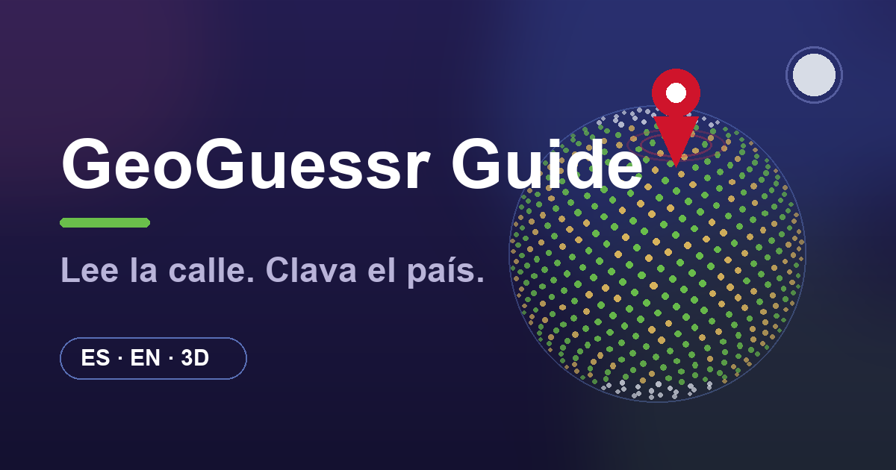

# GeoGuessr Guide

Guía visual en español e inglés para aprender GeoGuessr: lee la calle, clava el país.

Visual ES/EN guide to learn GeoGuessr: read the street, nail the country.



## Qué incluye

- **Matrículas** — 79 países con dibujo fiel, filtro por color, continente y duelos clásicos (NL/LU, IT/AL…).
- **Bollards** — 25 modelos 3D (Three.js) con visor 360°: AU/NZ/TR, cuña italiana, poste amarillo islandés…
- **Postes** — 14 postes eléctricos en 3D: crucetas, celosías, escalera española, agujeros húngaros…
- **Idiomas** — 11 escrituras con quiz de práctica.
- **Países** — prefijos, dominios, lado de conducción y mapa offline con zoom.
- **Hero 3D interactivo** — Tierra por puntos + Luna; haz clic en el planeta para mover el pin (con sonido).
- **Práctica** — identificador en 3 pasos que descarta candidatos.

## Desarrollo

```bash
npm install
npm run dev      # http://localhost:5173
npm run build    # salida en dist/
npm run preview  # previsualizar el build
```

Sin backend. Solo `three` como dependencia de runtime; todo lo demás es JS + CSS propio.

## Fuentes

- Pistas verificadas con [Plonkit](https://www.plonkit.net/guide), [GeoCoach](https://www.geocoach.me), [LearnableMeta](https://learnablemeta.com) y [GeoHints](https://www.geohints.com).
- Fotos: Wikimedia Commons y Mapillary con atribución (ver sección Atribuciones en la web).
- Sin imágenes de Google Street View. Proyecto educativo, no afiliado a GeoGuessr AB.

## Hecho por

**andyechc**
